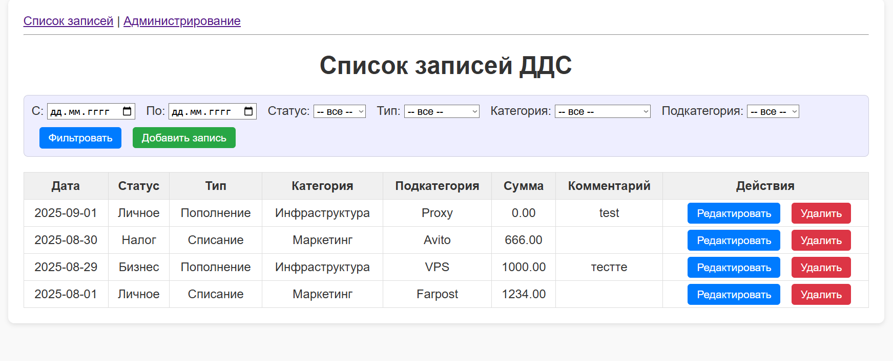
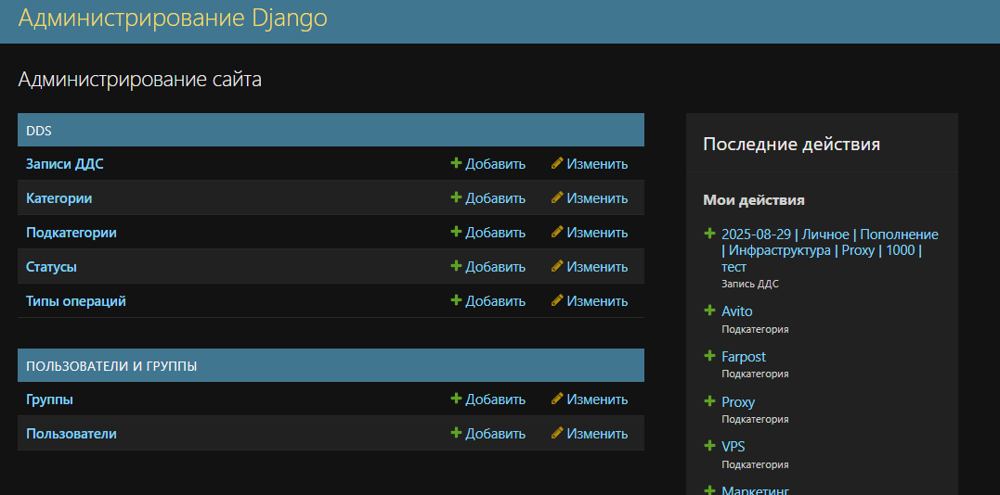
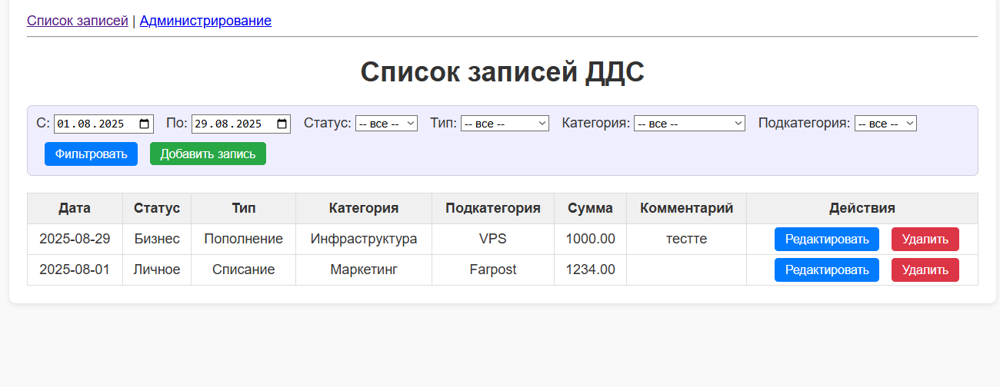
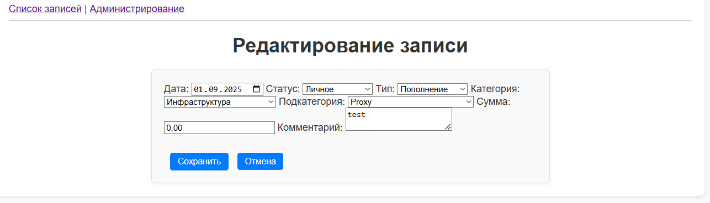

# CashFlow
Чтобы запустить это приложение вам понадобится Docker.
1. склонируйте репозиторий на свое устройство.
2. запустите ваш Docker-engine
3. в терминале в папке проекта выполните "docker compose up --build"
4. дождитесь, пока контейнер запустится и применит миграции.
готово! приложение запущено в контейнере и готово к использованию по ссылке http://localhost:8000/
Вы должны увидеть что-то похожее:

Для начала нужно создать справочники статусов, типов, категорий и подкатегорий. Для этого нужно перейти в раздел "Администрирование"
логин/пароль: admin/admin
Вы увидите стандартный интерфейс администрирования Django:

Вам нужно добавить хотя бы по одному статусу, типу, категории и подкатегории. Обратите внимание, что для категории нужно выбрать тип, а для подкатегории - категорию.
Когда вы закончите редактировать справочники, можно вернуться на главную страницу.
Чтобы добавить запись используйте кнопку "Добавить запись". Чтобы отфильтровать записи в таблице, выставьте нужные фильтры и используйте кнопку "Фильтровать".

Для редактирования записи используйте соответствующую кнопку. Вы увидите примерно это:

Чтобы удалить запись, используйте соответствующую кнопку и подтвердите удаление.